<!-- _footer: 'https://github.com/Codebytes/kubernetes-resiliency' -->

# <!--fit--> Kubernetes Resiliency

## Chris Ayers 

---

## Chris Ayers
### Senior Customer Engineer Microsoft

<i class="fa-brands fa-twitter"></i> Twitter: @Chris\_L\_Ayers
<i class="fa-brands fa-mastodon"></i> Mastodon: @Chrisayers@hachyderm.io
<i class="fa-brands fa-linkedin"></i> LinkedIn: [chris-l-ayers](https://linkedin.com/in/chris-l-ayers/)
<i class="fa fa-window-maximize"></i> Blog: [https://chris-ayers.com/](https://chris-ayers.com/)
<i class="fa-brands fa-github"></i> GitHub: [Codebytes](https://github.com/codebytes)

---

# Agenda

- Infrastructure
- Kubernetes Components
- Networking
- Applications & Services
- Testing

<video width="100%" autoplay loop muted>
  <source src="./img/cargo-ship.mp4" type="video/mp4" />
  Your browser does not support the video tag.
</video>

---

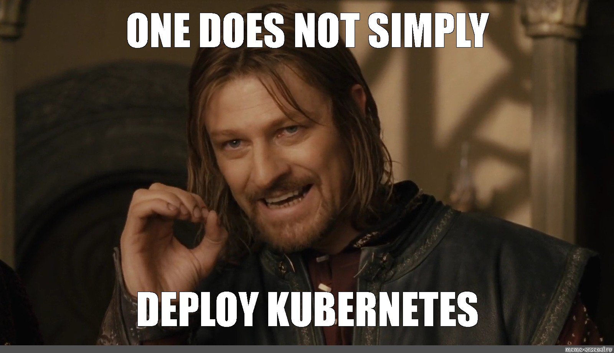

---

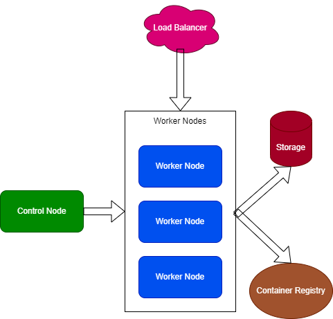

## Infrastructure

- Single Points of Failure
- Availability Zones
- Node Pools

---

### Single Points of Failure / Failure Domains

- **Failure Domains**: Areas where localized failures occur.
- Avoid single points of failure to maintain operational cluster resilience.
  - Compute (Nodes)
  - Storage (PV)
  - Networking (LB)
- Distribute workloads across multiple nodes, availability zones, and regions.
- Manage clusters across multiple regions using Kubernetes Federation.

---

### Planning for Failure Domains
- **Multi-zonal and Multi-regional Deployments**
- **Topology Awareness**
- **Replica Distribution**

---

### Availability Zones

- Use Zone Aware services for high availability.
  - Storage
  - Load Balancers
  - Registries
- Utilize Kubernetes topologySpreadConstraints feature to control scheduling

---

### Kubernetes TopologySpreadConstraints

Utilize Kubernetes' topologySpreadConstraints feature to automatically spread workloads.

- Provides **fine-grained control over Pod placement** across different topologies
- Helps distribute Pods **evenly across Nodes, Zones, Racks, or Regions**
- User defines `maxSkew` to limit **Pod count disparity** across Nodes

 
 
 
 

graph BT
    subgraph "zoneB"
        direction BT
        p3(Pod) --> n3(Node3)
        n4(Node4)
    end
    subgraph "zoneA"
        direction BT
        p1(Pod) --> n1(Node1)
        p2(Pod) --> n2(Node2)
    end
  classDef plain fill:#ddd,stroke:#fff,stroke-width:4px,color:#000;
  classDef k8s fill:#326ce5,stroke:#fff,stroke-width:4px,color:#fff;
  classDef cluster fill:#fff,stroke:#bbb,stroke-width:2px,color:#326ce5;
  class n1,n2,n3,n4,p1,p2,p3 k8s;
  class zoneA,zoneB cluster;

---

### Node Pools

- **Configuration Uniformity**: Group similar nodes for consistency.
- **Enhanced Management**: Facilitate scalability and updates through structured node pool strategies.
- **Distributed Setup**: Ensure high availability by spreading node pools across multiple zones.
- **Support Diversity**: Accommodate various hardware and instance types.
- **Workload Segregation**: Utilize Kubernetes taints and tolerations to manage workload distribution.

---

### System vs User Node Pools
 
 
 
 
 
 
 
 

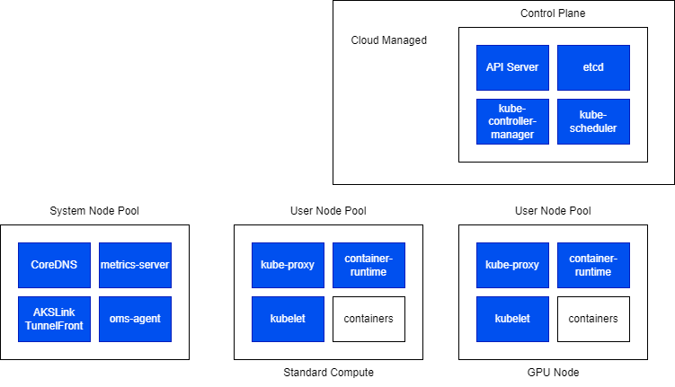

---

# Kubernetes Federation / Fleet Management

- **Federation**
- **Fleet Management**

- **Unified Management**
- **Cross-Cluster Scheduling**
- **Resource Sharing**

---

### Infrastructure Best Practices

- **Update Regularly**: Align infrastructure with current needs.
- **Monitor Performance**: Track metrics across nodes and zones.
- **Implement Auto-Scaling**: Adjust node pools based on demand.
- **Use IaC Tools**: Manage configurations with Bicep or Terraform.
- **Establish Disaster Recovery**: Ensure robust backup and restoration protocols.

---

## Kubernetes Components 

---

## Kubernetes Control Plane Components Overview

- kube-apiserver
- etcd
- kube-scheduler
- kube-controller-manager
- cloud-controller-manager

---

## Kubernetes Node Components Overview

- kubelet
- kube-proxy
- Container runtime

---

### High Availability (HA) in Kubernetes

- **Redundancy**: Deploy multiple instances of components with leader election and data backups.
- **Monitoring**: Continuously monitor each component.
- **Resilience**: Implement automatic restart strategies for component failures.

- **Control Plane Components**: `kube-apiserver`, `etcd`, `kube-scheduler`, `kube-controller-manager`, `cloud-controller-manager`.
- **Node Components**: `kubelet`, `kube-proxy`.
- **Container Runtime**: Opt for HA-supportive runtimes like `containerd` or `CRI-O`.

---

### Additional High Availability Considerations

- **Addons**: Deploy as highly available components using ReplicaSets, Deployments, or StatefulSets and ensure fault tolerance.
- **Avoid naked pods!**

---

# Networking

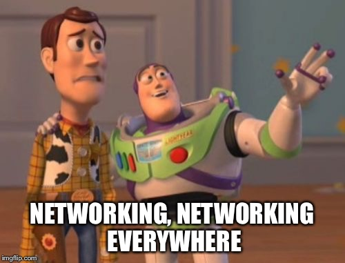

---

### Networking: Key Techniques

- **Rate Limiting**: Control traffic flow to services to prevent overload.
- **Circuit Breaking**: Prevent failures from cascading across services.
- **Service Mesh**: Manage service-to-service communications with enhanced security and observability.

---

### Rate Limiting

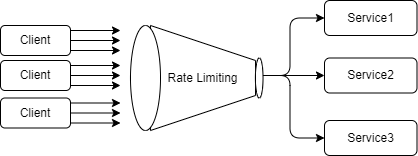

Rate limiting is a technique for limiting network traffic. It sets a limit on how many requests a client can make to a server in a given amount of time. 

- Protects your services from being overwhelmed by too much traffic.
- Can be implemented at the application level or using a proxy server.

---

### Circuit Breaking

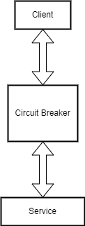

Circuit breaking is a technique used to prevent an application from trying to perform an operation that's likely to fail, allowing it to continue to operate without waiting for the fault or timeout to be fixed.

- Prevents application failure from cascading to other services.
- Allows applications to fail fast and recover rapidly.

---

### Service Meshes

A **service mesh** is a dedicated infrastructure layer designed to facilitate service-to-service communications between microservices, typically using a sidecar proxy.

- **Improved Traffic Management**: Load balancing, rate limiting, circuit breaking.
- **Enhanced Observability**: Insights, metrics, logs, traces.
- **Robust Security**: Mutual TLS, service-to-service communications.
- **Simplified Service Discovery**: Dynamic service discovery.

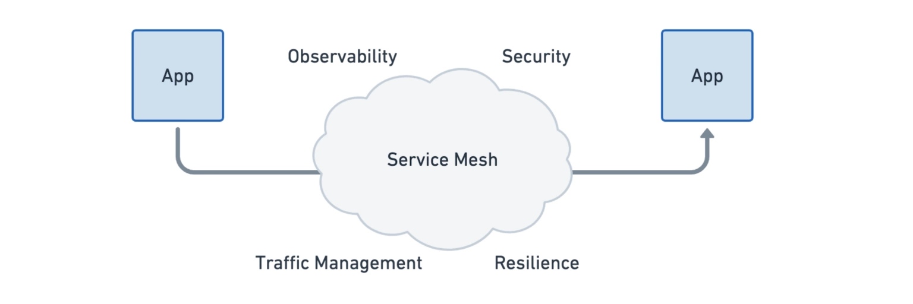

---

### The Evolution of Service Mesh Architecture

**From Library to Kernel:**

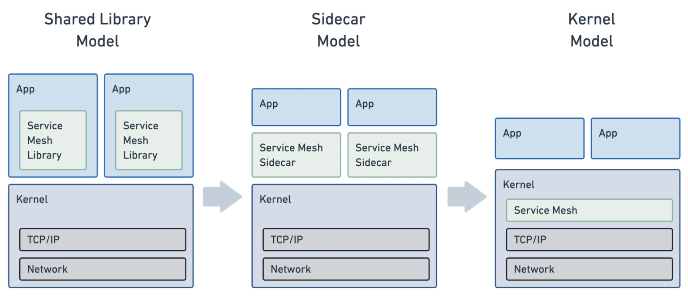

---

### eBPF

eBPF (Extended Berkeley Packet Filter) extends the Linux kernel's capabilities without changing its code, leading to a new paradigm in service mesh implementation.

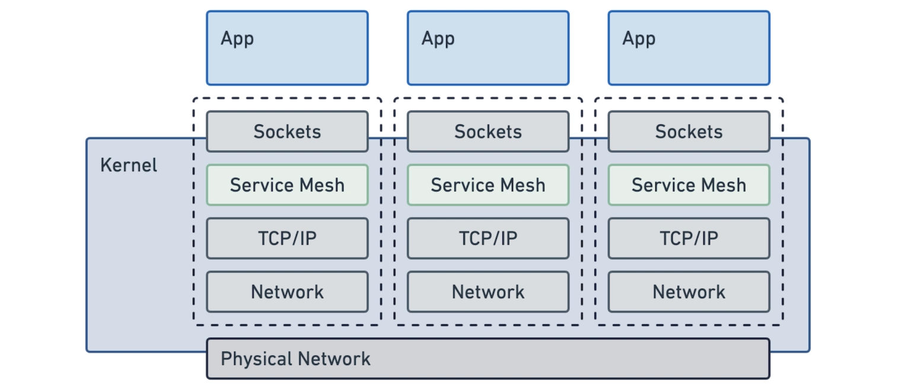

---

## Applications

- Deployment Patterns
- Horizontal Pod Autoscaler
- Kubernetes Event-driven Autoscaling (KEDA)
- Pod Disruption Budgets
- Resource Requests and Limits
- Liveness, Readiness, and Startup Probes

---

# Blast Radius of Change

- The "Blast Radius" refers to the potential impact of a change or failure.
- Understanding and managing the blast radius is crucial in minimizing disruptions.

---

# Feature Flags & Toggles

- Enable/Disable features without deploying new code.
- Gradually roll out features to a subset of users.
- Easily roll back problematic features.
- Test in production, ensuring real-world performance.

---

# Canary Deployments

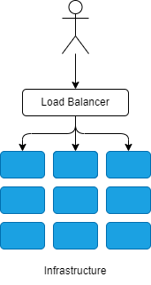

A release strategy involving gradual rollout to a small group before full deployment.

---

# Canary Deployments

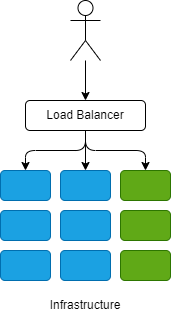

"Canaries" are the initial users/servers to detect issues or bugs in the new release.

---

# Canary Deployments

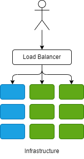

Incremental deployment reduces the risk of widespread outages.

---

# Canary Deployments

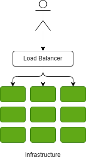

Continuous monitoring and feedback gather performance insights.

---

# Blue Green Deployments

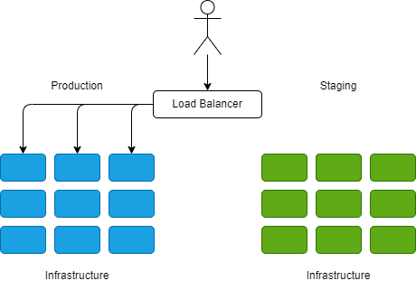

- Parallel Environments: Maintain Blue (production) and Green (updates).
- Zero Downtime: Switch between Blue and Green without downtime.
- Testing & Validation: Thoroughly validate updates in the Green environment.
- Instant Rollback: Quickly revert to the stable Blue environment if issues arise.

---

# Blue Green Deployments

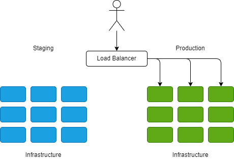

- Controlled Release: Gradually shift traffic from Blue to Green.
- Canary Testing: Test updates with a small portion of traffic in the Green environment.
- Traffic Cut-Over: Switch all traffic to Green after successful validation.
- Rollback Option: Instantly return to the stable Blue environment if needed.

---

### Monitoring and Observability Essentials

Ensure system reliability, performance, and security.
  - Detect issues early with proactive monitoring.
  - Gain deep insights for optimization through continuous observability.

---

### Metrics Server

 

The resource metrics pipeline provides a limited set of metrics related to cluster components such as the Horizontal Pod Autoscaler controller, as well as the kubectl top utility. These metrics are collected by the lightweight, short-term, in-memory metrics-server and are exposed via the metrics.k8s.io API.

flowchart BT
subgraph cluster[Cluster]
direction RL
S[    ]
A[Metrics- Server]
subgraph B[Nodes]
direction TB
D[cAdvisor] --> C[kubelet]
E[Container runtime] --> D
E1[Container runtime] --> D
P[pod data] -.- C
end
L[API server]
W[HPA]
C ---->|Summary API| A -->|metrics API| L --> W
end
L ---> K[kubectl top]
classDef box fill:#fff,stroke:#000,stroke-width:1px,color:#000;
class W,B,P,K,cluster,D,E,E1 box
classDef spacewhite fill:#ffffff,stroke:#fff,stroke-width:0px,color:#000
class S spacewhite
classDef k8s fill:#326ce5,stroke:#fff,stroke-width:1px,color:#fff;
class A,L,C k8s

---

### Horizontal Pod Autoscaler

<br/ >

- **Handling Traffic Spikes**
- **Efficient Resource Usage** 
- **Custom Metrics Scaling**
- **Stability During Failures**

> The Horizontal Pod Autoscaler (HPA) in Kubernetes enhances application resilience by dynamically adjusting the number of pod replicas based on observed performance metrics.

 
 

graph BT
hpa[Horizontal Pod Autoscaler] --> scale[Scale]
subgraph rc [RC / RS / Deployment]
scale
end
scale -.-> pod1[Pod 1]
scale -.-> pod2[Pod 2]
scale -.-> pod3[Pod N]
classDef hpa fill:#D5A6BD,stroke:#1E1E1D,stroke-width:1px,color:#1E1E1D;
classDef rc fill:#F9CB9C,stroke:#1E1E1D,stroke-width:1px,color:#1E1E1D;
classDef scale fill:#B6D7A8,stroke:#1E1E1D,stroke-width:1px,color:#1E1E1D;
classDef pod fill:#9FC5E8,stroke:#1E1E1D,stroke-width:1px,color:#1E1E1D;
class hpa hpa;
class rc rc;
class scale scale;
class pod1,pod2,pod3 pod

---

### Kubernetes Event-driven Autoscaling (KEDA)

- **Event-Driven Scaling**: Scale based on events.
- **Various Event Sources**: Kafka, RabbitMQ, Azure Service Bus.
- **Scaling to Zero**: Save resources when no events.
- **Works With Kubernetes HPA**: Extend HPA for external metrics.

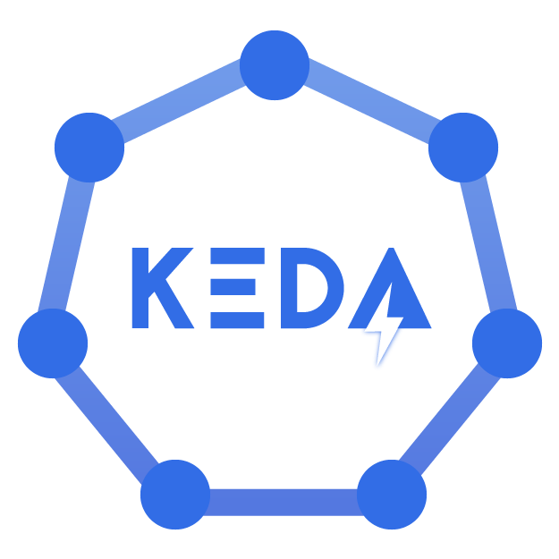

---

### Pod Disruption Budgets (PDB)

- **Purpose**: Ensures pod availability during both planned and unplanned disruptions.
- **Key Definitions**:
  - **Minimum Available**: Minimum operational pods.
  - **Maximum Unavailable**: Maximum disrupted pods.

**Use Cases and Limitations**:
- Maintains application continuity during operational changes.
- May delay node-related operations and affect scaling.

---

# Resource Requests and Limits

---

| **Resource Requests** | **Resource Limits** |
|-----------------------|---------------------|
| Ensure that containers have sufficient CPU and memory to function optimally. | Cap the maximum resources a container may consume. |
| Influence Kubernetes scheduling decisions to maintain a balanced resource distribution and prevent starvation. | Protect the stability of the node and prevent any single container from monopolizing resources, which can lead to system-wide issues. |

---

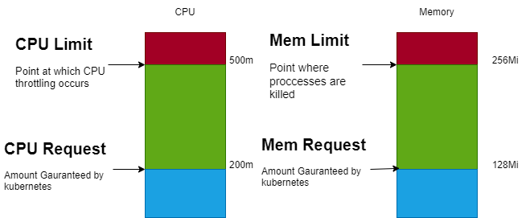

---

### Best Practices for Configuration

Properly configuring requests and limits is vital:

- **Requests** should reflect the minimum necessary resources for normal application function.
- **Limits** should be set to prevent applications from causing disruptions due to unexpected or excessive resource usage, without being so restrictive that they cause the application to be throttled unnecessarily.
---

### Quality of Service (QoS) Classes in Kubernetes

| **QoS Class** | **Description** | **Pod Eviction Order** |
|---|-----------------|------------------------|
| **Guaranteed** | Containers have equal  memory/CPU limits and requests. | Least likely to be evicted |
| **Burstable** | At least one container has a  memory or CPU request or limit. | Middle priority for eviction |
| **BestEffort** | No containers have a   memory/CPU limit or request. | Most likely to be evicted |

---

### PriorityClass for Pod Scheduling and Eviction

**PriorityClass** is a non-namespaced object that defines the relative priority of Pods to control scheduling and eviction policies under resource contention.

**Features**:
- **Resource Assurance**: Assigns priorities to ensure critical workloads are scheduled first and receive the necessary resources.
- **Controlled Eviction**: Manages pod eviction in a structured manner to maintain stability during high demand or limited resources.

---

# Probes

---

  

  #### Liveness Probes
  - Checks container run status.
  - Restarts on failure.
  - Auto-recovers failed containers.

  

  

  
  #### Readiness Probes
  - Verifies readiness to handle traffic.
  - Blocks traffic on failure.
  - Ensures traffic to healthy containers only.

  

  

  
  #### Startup Probes
  - Allows time for slow-starting containers to boot.
  - Postpones Liveness and Readiness Probes until successful start.
  - Vital for apps with complex initializations or large data loads.

  

---

# Testing

---

---

## Load Testing Your Cluster

Load testing is the practice of testing system performance under normal and peak usage conditions. It helps identify bottlenecks, performance degradation, and capacity limits in your Kubernetes cluster.

- Use load testing tools (like Azure Load Testing, Jmeter, Locust, Gatling, Siege, etc.)
- Test your services under normal and extreme conditions.
- Monitor performance metrics (CPU, Memory, Network IO).
- Improve scalability & resilience based on findings.

---

## Chaos Testing

Chaos Testing, or Chaos Engineering, is the discipline of experimenting on a system to uncover its weaknesses.

- Introduce failures into your Kubernetes cluster deliberately (like pod failures, network failures, etc.) using tools like Azure Chaos Studio, Litmus, Chaos Mesh, PowerfulSeal.
- Test the system's ability to maintain availability and minimize impact.
- Helps in building robust, fault-tolerant systems by proactively identifying and fixing potential issues.

---

# Conclusion

- Kubernetes excels at providing resiliency, ideal for managing complex, distributed systems.
- Optimized infrastructure, regular monitoring, and adaptability are key to ensuring high availability and stability.
- High availability of Kubernetes components and applications is crucial for system resilience.
- Kubernetes ensures application availability via mechanisms such as Pod Disruption Budgets, Resource Requests, Limits, and Probes.
- Continuous improvement and adaptability to change are critical to maintaining resiliency and performance.

---

# Questions

---

# Resources 

## Links

- [Kubernetes Documentation](https://kubernetes.io/docs/home/)
- [Kubernetes Production Best Practices](https://learnk8s.io/production-best-practices)
- [https://github.com/codebytes](https://github.com/codebytes)

## Chris Ayers 

<i class="fa-brands fa-twitter"></i> Twitter: @Chris\_L\_Ayers
<i class="fa-brands fa-mastodon"></i> Mastodon: @Chrisayers@hachyderm.io
<i class="fa-brands fa-linkedin"></i> LinkedIn: [chris-l-ayers](https://linkedin.com/in/chris-l-ayers/)
<i class="fa fa-window-maximize"></i> Blog: [https://chris-ayers.com/](https://chris-ayers.com/)
<i class="fa-brands fa-github"></i> GitHub: [Codebytes](https://github.com/codebytes)

<!-- Needed for mermaid, can be anywhere in file except frontmatter -->
