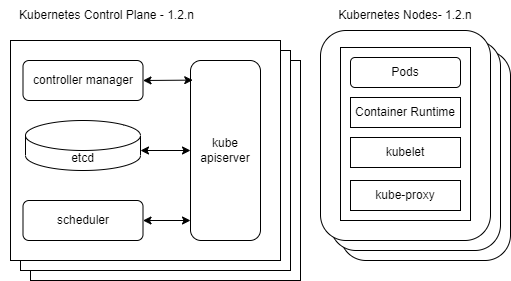
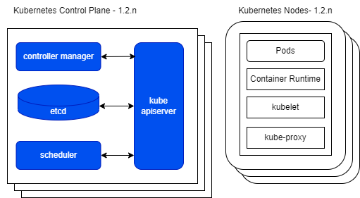
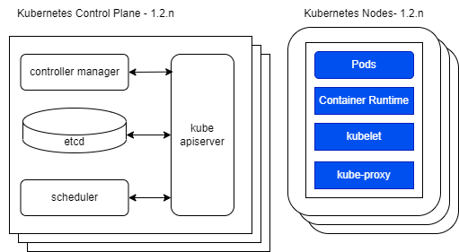
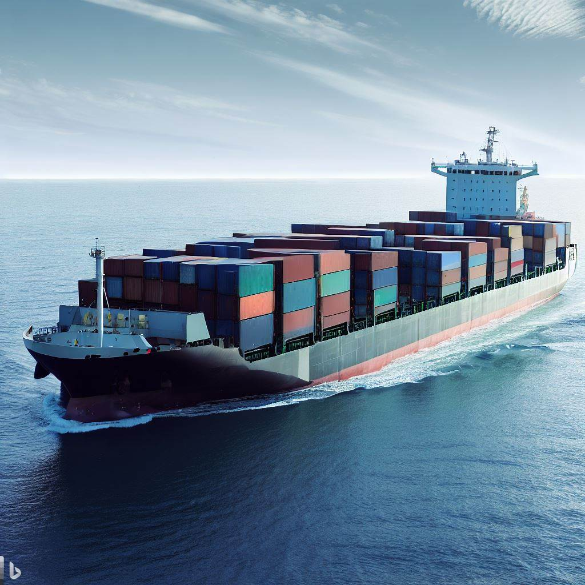

<!-- _footer: 'https://github.com/Codebytes/kubernetes-resiliency' -->

# <!--fit--> Kubernetes Resiliency

## Chris Ayers 

---

## Chris Ayers
### Senior Customer Engineer Microsoft

<i class="fa-brands fa-twitter"></i> Twitter: @Chris\_L\_Ayers
<i class="fa-brands fa-mastodon"></i> Mastodon: @Chrisayers@hachyderm.io
<i class="fa-brands fa-linkedin"></i> LinkedIn: [chris-l-ayers](https://linkedin.com/in/chris-l-ayers/)
<i class="fa fa-window-maximize"></i> Blog: [https://chris-ayers.com/](https://chris-ayers.com/)
<i class="fa-brands fa-github"></i> GitHub: [Codebytes](https://github.com/codebytes)

---

# Agenda

- Infrastructure
- Kubernetes Components
- Networking
- Applications & Services

<video width="100%" autoplay loop muted>
  <source src="./img/cargo-ship.mp4" type="video/mp4" />
  Your browser does not support the video tag.
</video>

---

## Infrastructure

- Single Points of Failure
- Availability Zones
- Node Pools

---

### Single Points of Failure

- Avoid single points of failure to maintain operational cluster resilience.
  - Compute (Nodes)
  - Storage (PV)
  - Networking (LB)
- Distribute workloads across multiple nodes, availability zones, and regions.
- Manage clusters across multiple regions using Kubernetes Federation.

---

### Availability Zones

- Distribute workloads across multiple availability zones for high availability.
- Leverage Regional Persistent Volumes (PVs) for storage across multiple zones.
- Configure your load balancer to distribute traffic across multiple nodes.

---

### Kubernetes TopologySpreadConstraints

Utilize Kubernetes' topologySpreadConstraints feature to automatically spread workloads.

- Provides **fine-grained control over Pod placement** across different topologies
- Helps distribute Pods **evenly across Nodes, Zones, Racks, or Regions**
- User defines `maxSkew` to limit **Pod count disparity** across Nodes

 
 
 
 

graph BT
    subgraph "zoneB"
        direction BT
        p3(Pod) --> n3(Node3)
        n4(Node4)
    end
    subgraph "zoneA"
        direction BT
        p1(Pod) --> n1(Node1)
        p2(Pod) --> n2(Node2)
    end
classDef plain fill:#ddd,stroke:#fff,stroke-width:4px,color:#000;
classDef k8s fill:#326ce5,stroke:#fff,stroke-width:4px,color:#fff;
classDef cluster fill:#fff,stroke:#bbb,stroke-width:2px,color:#326ce5;
class n1,n2,n3,n4,p1,p2,p3 k8s;
class zoneA,zoneB cluster;

---

### Node Pools

- Group nodes with the same configuration.
- Enable effective cluster management and scalability.
- Spread node pools across multiple availability zones for high availability.
- Support heterogeneous cluster configurations with different instance types or hardware.
- Simplify cluster management with separate upgrade and scaling processes for different node types.
- Use Kubernetes taints and tolerations to segregate workloads on specific node pools.

---

### Infrastructure Best Practices

- Regularly review and update infrastructure to meet changing requirements.
- Monitor and analyze node, availability zone, and node pool performance.
- Use auto-scaling groups to adjust node pool sizes based on demand.
- Implement infrastructure as code (IaC) tools like Bicep or Terraform for infrastructure configuration management.
- Establish a disaster recovery plan, including backup and restoration processes for cluster data and applications.

---

## Kubernetes Components 

---

## Kubernetes Control Plane Components Overview

- kube-apiserver
- etcd
- kube-scheduler
- kube-controller-manager
- cloud-controller-manager

---

## Kubernetes Node Components Overview

- kubelet
- kube-proxy
- Container runtime

---

### High Availability (HA) in Kubernetes

- Deploying multiple instances of components
  -  Using leader election for coordination
  -  Regular backup of important data. 
- Each component requires monitoring
- A strategy for automatic restart upon failure. 

- **Control Plane Components**: kube-apiserver, etcd, kube-scheduler, kube-controller-manager, and cloud-controller-manager.
- **Node Components**: kubelet and kube-proxy.
- **Container Runtime**: Choose a runtime that supports HA, such as containerd or CRI-O.

  

---

### Additional High Availability Considerations

- **Addons**: Deploy as highly available components using ReplicaSets, Deployments, or StatefulSets and ensure fault tolerance.
- **Container Runtime**: Use Kubernetes features like PodDisruptionBudgets and ReplicaSets for application availability.

---

# Networking

1. **Service Discovery**: Built-in service discovery allows Kubernetes to automatically route traffic to healthy service instances in case of failures.
2. **Load Balancing**: Distributes incoming service traffic evenly across services or pods, preventing individual overload.

3. **Network Policies**: Define rules for pod communication, contributing to security and stability.
4. **Ingress Controllers**: Handle external traffic requests, route them based on rules, and provide features like rate limiting and circuit breaking.

---

### Rate Limiting

Rate limiting is a technique for limiting network traffic. It sets a limit on how many requests a client can make to a server in a given amount of time. 

- Protects your services from being overwhelmed by too much traffic.
- Can be implemented at the application level or using a proxy server.

### Circuit Breaking

Circuit breaking is a technique used to prevent an application from trying to perform an operation that's likely to fail, allowing it to continue to operate without waiting for the fault or timeout to be fixed.

- Prevents application failure from cascading to other services.
- Allows applications to fail fast and recover rapidly.

---

### Metrics Server

 

The resource metrics pipeline provides a limited set of metrics related to cluster components such as the Horizontal Pod Autoscaler controller, as well as the kubectl top utility. These metrics are collected by the lightweight, short-term, in-memory metrics-server and are exposed via the metrics.k8s.io API.

flowchart BT
subgraph cluster[Cluster]
direction RL
S[    ]
A[Metrics- Server]
subgraph B[Nodes]
direction TB
D[cAdvisor] --> C[kubelet]
E[Container runtime] --> D
E1[Container runtime] --> D
P[pod data] -.- C
end
L[API server]
W[HPA]
C ---->|Summary API| A -->|metrics API| L --> W
end
L ---> K[kubectl top]
classDef box fill:#fff,stroke:#000,stroke-width:1px,color:#000;
class W,B,P,K,cluster,D,E,E1 box
classDef spacewhite fill:#ffffff,stroke:#fff,stroke-width:0px,color:#000
class S spacewhite
classDef k8s fill:#326ce5,stroke:#fff,stroke-width:1px,color:#fff;
class A,L,C k8s

---

## Applications

- Horizontal Pod Autoscaler
- Pod Disruption Budgets
- Resource Requests and Limits
- Liveness and Readiness Probes

---

### Horizontal Pod Autoscaler

<br/ >

- **Handling Traffic Spikes**
- **Efficient Resource Usage** 
- **Custom Metrics Scaling**
- **Stability During Failures**

> The Horizontal Pod Autoscaler (HPA) in Kubernetes enhances application resilience by dynamically adjusting the number of pod replicas based on observed performance metrics.

graph BT
hpa[Horizontal Pod Autoscaler] --> scale[Scale]
subgraph rc [RC / RS / Deployment]
scale
end
scale -.-> pod1[Pod 1]
scale -.-> pod2[Pod 2]
scale -.-> pod3[Pod N]
classDef hpa fill:#D5A6BD,stroke:#1E1E1D,stroke-width:1px,color:#1E1E1D;
classDef rc fill:#F9CB9C,stroke:#1E1E1D,stroke-width:1px,color:#1E1E1D;
classDef scale fill:#B6D7A8,stroke:#1E1E1D,stroke-width:1px,color:#1E1E1D;
classDef pod fill:#9FC5E8,stroke:#1E1E1D,stroke-width:1px,color:#1E1E1D;
class hpa hpa;
class rc rc;
class scale scale;
class pod1,pod2,pod3 pod

---

### Pod Disruption Budgets (PDB)

- **Pod Disruption**: Impacts the running state of a Pod, making it unavailable. 
    - Involuntary: Unplanned scenarios like hardware failures. 
    - Voluntary: Planned actions like manual upgrades.
- **Pod Disruption Budget (PDB)**: Sets rules for the number of disruptions an application can handle. 

#### PDB Definitions
> **Minimum Available**:  Minimum number of replicas of a Pod that must be available.
> **Maximum Unavailable**: Maximum number of replicas that can be unavailable.

<!--

## PDB Pitfalls
1. May block or delay certain operations like node drain or Kubernetes version upgrades.
2. Could impact the ability to scale down the cluster.

 ## PDB Use-cases
1. Ensuring a single instance app remains running during autoscaling.
2. Keeping highly available apps running during operations that would otherwise disrupt all replicas.
3. Enforcing rolling updates to ensure continuous availability.

Note: PDB won't prevent direct removal of Pods, total node removal, but it can help manage disruptions due to node memory pressure and node pool upgrades.

 -->

---

  

  ## Resource Requests

  - Minimum resources required by a container.
  - Can specify CPU and memory needs to ensure optimal performance.
  - Helps in scheduling decisions, as containers with unsatisfied requests won't be deployed.

  

  

  
  ## Resource Limits

  - Maximum resources a container can use.
  - Limits act as a safety guard against resource overuse, ensuring fair usage across all containers.
  - When a container exceeds the set limit, it can be terminated or throttled.

  

---

## Quality of Service (QoS) Classes 

- **Guaranteed**
  - Containers have equal memory/CPU limits and requests
- **Burstable**
  - At least one Container has a memory or CPU request or limit
- **BestEffort**
  - No Containers have a memory/CPU limit or request

- **QoS etermines Pod eviction order** under Node pressure: 
  - BestEffort, Burstable, Guaranteed
- **Memory QoS with cgroup v2 (alpha)**
  - Uses cgroup v2 for guaranteed memory resources
  - Works in conjunction with, but separate from, QoS class assignments

---

  

  ## Liveness Probes

  - Check if a container is running.
  - Restart the container if the probe fails.
  - Ensure failed containers are automatically recovered.

  

  

  
  ## Readiness Probes

  - Check if a container is ready to serve traffic.
  - Stop sending traffic to the container if the probe fails.
  - Ensure only healthy containers receive traffic.

  

---

# Conclusion

- Kubernetes excels at providing resiliency, ideal for managing complex, distributed systems.
- Optimized infrastructure, regular monitoring, and adaptability are key to ensuring high availability and stability.
- High availability of Kubernetes components and applications is crucial for system resilience.
- Kubernetes ensures application availability via mechanisms such as Pod Disruption Budgets, Resource Requests, Limits, and Probes.
- Continuous improvement and adaptability to change are critical to maintaining resiliency and performance.

---

# Questions

---

# Resources 

## Links

- [Kubernetes Documentation](https://kubernetes.io/docs/home/)
- [Kubernetes Production Best Practices](https://learnk8s.io/production-best-practices)
- [https://github.com/codebytes](https://github.com/codebytes)

## Chris Ayers 

<i class="fa-brands fa-twitter"></i> Twitter: @Chris\_L\_Ayers
<i class="fa-brands fa-mastodon"></i> Mastodon: @Chrisayers@hachyderm.io
<i class="fa-brands fa-linkedin"></i> LinkedIn: [chris-l-ayers](https://linkedin.com/in/chris-l-ayers/)
<i class="fa fa-window-maximize"></i> Blog: [https://chris-ayers.com/](https://chris-ayers.com/)
<i class="fa-brands fa-github"></i> GitHub: [Codebytes](https://github.com/codebytes)

<!-- Needed for mermaid, can be anywhere in file except frontmatter -->
