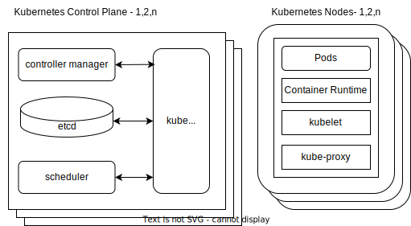

<!-- _footer: 'https://github.com/Codebytes/kubernetes-resiliency' -->

# <!--fit--> Kubernetes Resiliency

## Chris Ayers 

---

## Chris Ayers
### Senior Customer Engineer Microsoft

<i class="fa-brands fa-twitter"></i> Twitter: @Chris\_L\_Ayers
<i class="fa-brands fa-mastodon"></i> Mastodon: @Chrisayers@hachyderm.io
<i class="fa-brands fa-linkedin"></i> LinkedIn: [chris-l-ayers](https://linkedin.com/in/chris-l-ayers/)
<i class="fa fa-window-maximize"></i> Blog: [https://chris-ayers.com/](https://chris-ayers.com/)
<i class="fa-brands fa-github"></i> GitHub: [Codebytes](https://github.com/codebytes)

---

# Agenda

- Infrastructure
- Components
- Applications

---

## Infrastructure

- Single Points of Failure
- Availability Zones
- Node Pools

---

### Single Points of Failure

- Avoid single points of failure to maintain operational cluster resilience.
- Distribute workloads across multiple nodes, availability zones, and regions.
- Use replication controllers or replica sets to maintain multiple replicas of your applications.
- Configure your load balancer to distribute traffic across multiple nodes.
- Employ a multi-master setup for etcd and the Kubernetes control plane components.

---

### Availability Zones

- Group of data centers within a region.
- Distribute workloads across multiple availability zones for high availability.
- Utilize Kubernetes' topologySpreadConstraints feature to automatically spread workloads.
- Leverage Regional Persistent Volumes (PVs) for storage across multiple zones.
- Manage clusters across multiple regions using Kubernetes Federation.

---

### Node Pools

- Group nodes with the same configuration.
- Enable effective cluster management and scalability.
- Spread node pools across multiple availability zones for high availability.
- Support heterogeneous cluster configurations with different instance types or hardware.
- Simplify cluster management with separate upgrade and scaling processes for different node types.
- Use Kubernetes taints and tolerations to segregate workloads on specific node pools.

---

### Infrastructure Best Practices

- Regularly review and update infrastructure to meet changing requirements.
- Monitor and analyze node, availability zone, and node pool performance.
- Use auto-scaling groups to adjust node pool sizes based on demand.
- Implement infrastructure as code (IaC) tools like Bicep or Terraform for infrastructure configuration management.
- Establish a disaster recovery plan, including backup and restoration processes for cluster data and applications.

---

## Kubernetes Control Plane Components Overview

- kube-apiserver
- etcd
- kube-scheduler
- kube-controller-manager
- cloud-controller-manager

---

## Kubernetes Node Components Overview

- kubelet
- kube-proxy
- Container runtime

---

### kube-apiserver High Availability

- Deploy multiple instances of kube-apiserver.
- Use a load balancer to distribute traffic among instances.
- Store the backing data in a highly available etcd cluster.
- Regularly back up etcd data.

---

### etcd High Availability

- Deploy etcd as a multi-node cluster.
- Configure each etcd node with the `--initial-cluster-state` flag for an existing cluster.
- Use an odd number of etcd nodes (e.g., 3, 5, 7) to maintain quorum.
- Regularly back up etcd data and have a restore strategy in place.

---

### kube-scheduler High Availability

- Run multiple instances of kube-scheduler.
- Use leader election to ensure only one active scheduler makes decisions at a time.
- Configure the `--leader-elect` flag for each kube-scheduler instance.

---

### kube-controller-manager High Availability

- Run multiple instances of kube-controller-manager.
- Use leader election to ensure only one active controller-manager runs controllers at a time.
- Configure the `--leader-elect` flag for each kube-controller-manager instance.

---

### cloud-controller-manager High Availability

- Run multiple instances of cloud-controller-manager.
- Use leader election to ensure only one active cloud-controller-manager runs controllers at a time.
- Configure the `--leader-elect` flag for each cloud-controller-manager instance.

---

### kubelet High Availability

- Ensure each node runs kubelet.
- Monitor kubelet processes and restart them if they fail.
- Use a Kubernetes cluster autoscaler to adjust the number of nodes based on demand.

---

### kube-proxy High Availability

- Run kube-proxy on each node in the cluster.
- Use a DaemonSet to automatically deploy and manage kube-proxy instances.
- Monitor kube-proxy processes and restart them if they fail.

---

### Container Runtime High Availability

- Choose a container runtime that supports high availability, such as containerd or CRI-O.
- Monitor the container runtime on each node and restart it if it fails.
- Use Kubernetes features like PodDisruptionBudgets and ReplicaSets to ensure application availability.

---

### Addons High Availability

- Deploy addons as highly available components using ReplicaSets, Deployments, or StatefulSets.
- Configure multiple replicas for each addon to ensure fault tolerance.
- Monitor and manage addon components to maintain their availability and performance.

---

## Conclusion

- Ensure high availability for all Kubernetes components.
- Monitor and manage components to maintain resiliency.
- Use addons to provide additional functionality and enhance the Kubernetes cluster.

---

## Applications

- Pod Disruption Budgets
- Resource Requests and Limits
- Liveness and Readiness Probes

---

### Pod Disruption Budgets

- Define the minimum number of pods that must be available.
- Ensure high availability during voluntary disruptions like node maintenance.
- Specify per-application or per-cluster pod disruption budgets.

---

### Resource Requests and Limits

- Requests: Minimum resources required by a container.
- Limits: Maximum resources a container can use.
- Maintain stability by preventing resource contention.

---

### Why Use Requests Over Limits?
- Requests ensure minimum resources for a container.
- Kubernetes uses requests for scheduling decisions.
  - Ensures containers have enough resources to run.
  - Prevents resource starvation for critical workloads.
- Limits cap resource usage to prevent overconsumption.
  - May cause containers to be terminated if exceeded.
  - Should be used as a safety net, not for scheduling purposes.
- Focusing on requests optimizes cluster resource utilization and stability.

---

  

  ## Liveness Probes

  - Check if a container is running.
  - Restart the container if the probe fails.
  - Ensure failed containers are automatically recovered.

  

  

  
  ## Readiness Probes

  - Check if a container is ready to serve traffic.
  - Stop sending traffic to the container if the probe fails.
  - Ensure only healthy containers receive traffic.

  

---

# Conclusion

- Kubernetes provides several features to ensure resiliency.
- Optimize infrastructure and applications for high availability and stability.
- Continuously monitor and adjust the cluster to maintain resiliency.

---

# Demos

---

# Questions

---

# Resources 

## Links

- [https://docs.microsoft.com/en-us/events/learntv/learnlive-iac-and-bicep/](https://docs.microsoft.com/en-us/events/learntv/learnlive-iac-and-bicep/)
- [https://github.com/codebytes](https://github.com/codebytes)

## Chris Ayers 

<i class="fa-brands fa-twitter"></i> Twitter: @Chris\_L\_Ayers
<i class="fa-brands fa-mastodon"></i> Mastodon: @Chrisayers@hachyderm.io
<i class="fa-brands fa-linkedin"></i> LinkedIn: [chris-l-ayers](https://linkedin.com/in/chris-l-ayers/)
<i class="fa fa-window-maximize"></i> Blog: [https://chris-ayers.com/](https://chris-ayers.com/)
<i class="fa-brands fa-github"></i> GitHub: [Codebytes](https://github.com/codebytes)

